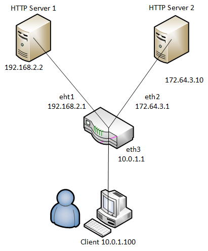
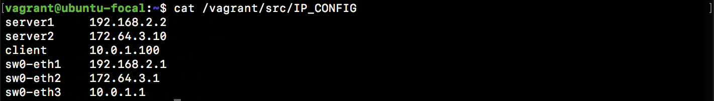
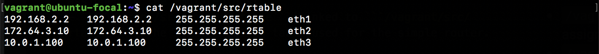
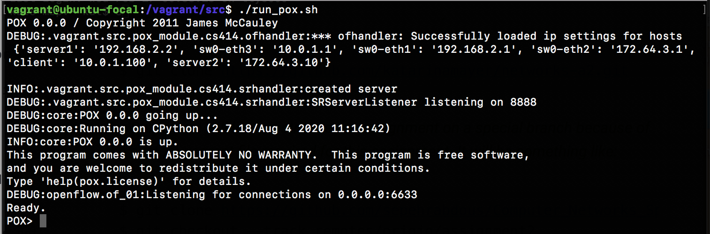
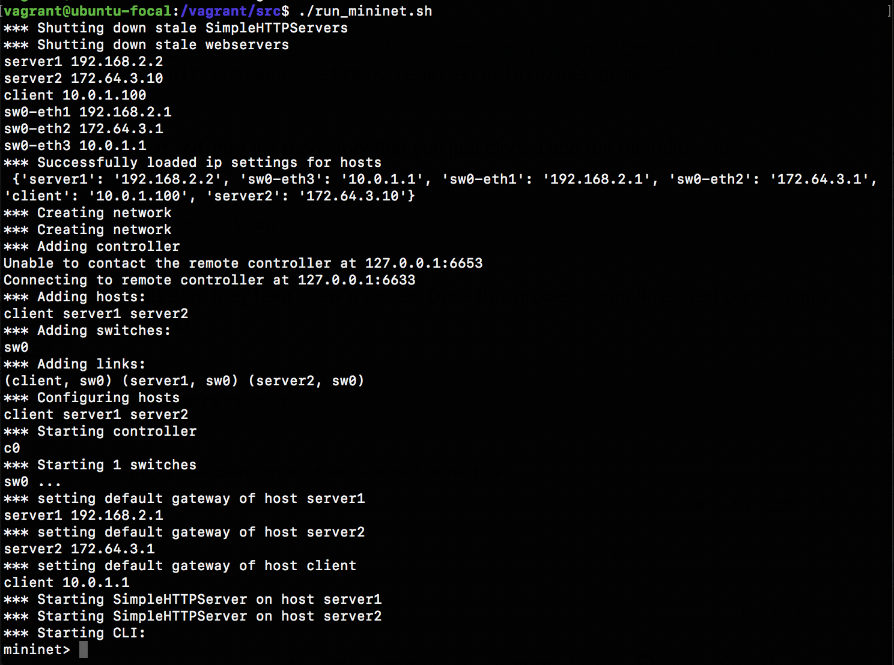
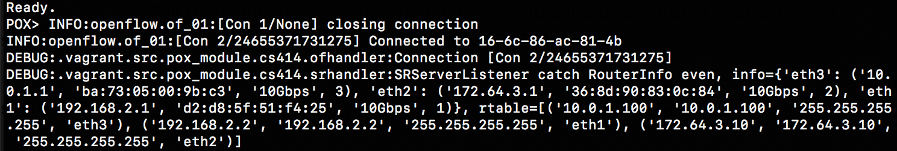
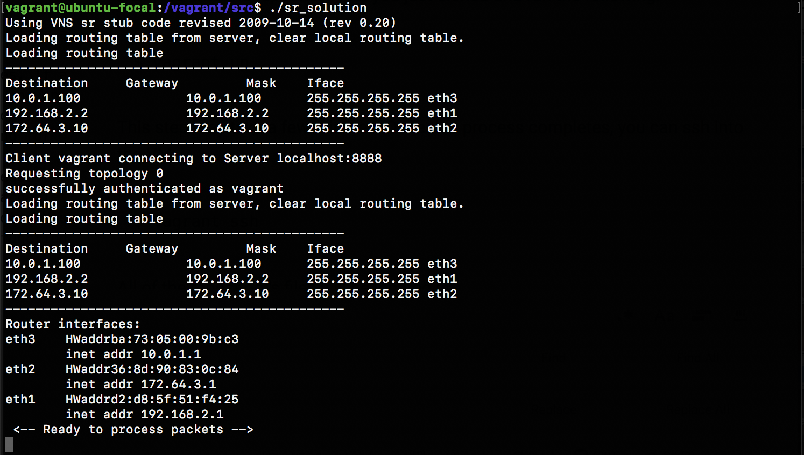
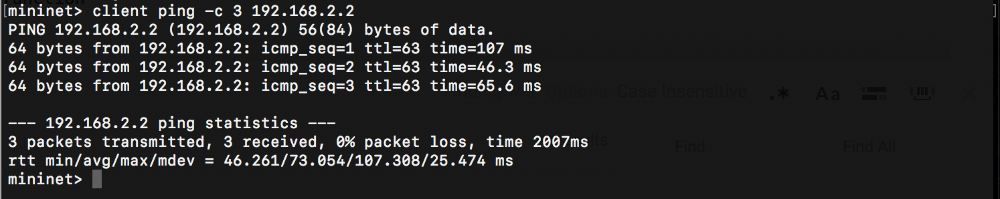
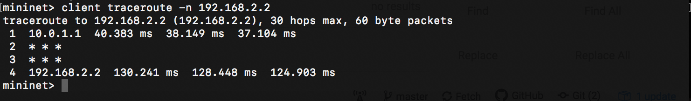
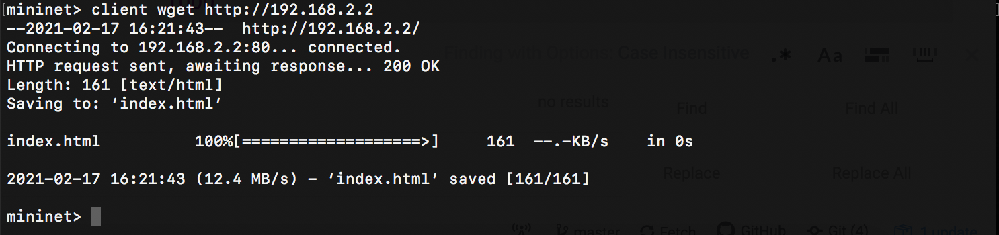

# Assignment 2: Router

This assignment is longer than the previous assignments, please start early. Please adhere to the [Submission Instructions](#submission-instructions) below.

---
## Introduction
In this assignment you will be writing a simple router with a static routing table. Your router will receive raw Ethernet frames. It will process the packets just like a real router, then forward them to the correct outgoing interface. We’ll make sure you receive the Ethernet frames; your job is to create the forwarding logic so packets go to the correct interface.

Your router will route real packets from an emulated host (client) to two emulated application servers (http server 1 and 2) sitting behind your router. The application servers are each running an HTTP server. When you have finished the forwarding path of your router, you should be able to access these servers using regular client software. In addition, you should be able to ping and traceroute to and through a functioning Internet router.



If the router is functioning correctly, all of the following operations should work:
- Ping from the client to any of the router’s interfaces (192.168.2.1, 172.64.3.1, 10.0.1.1).
- Ping from the client to any of the app servers (192.168.2.2, 172.64.3.10)
- Traceroute from the client to any of the router’s interfaces
- Traceroute from the client to any of the app servers
- Downloading a file using HTTP from one of the app servers

Detailed requirements are outlined below.

---
## Getting Started
This assignment runs on top of [Mininet](http://mininet.org), which allows you to emulate a topology on a single machine. It provides the needed isolation between the emulated nodes so that your router node can process and forward real Ethernet frames between the hosts like a real router.

We have set up Mininet on a custom Multipass VM for this assignment. This VM is different from the one provided in previous assignments, and **you should use this VM to test your code for the assignment**. This assignment assumes that you have already downloaded and installed the Multipass VM. Refer to README-VM.md for instructions on how to set up the VM. **Make sure your environment is set up and working properly before continuing!**

### Configuration Files
There are two configuration files for the router.
- ```.../Assignment2/src/IP_CONFIG```: Lists out the IP addresses assigned to the emulated hosts.
- ```.../Assignment2/src/router/rtable```: The static routing table used for the simple router.


The default ```IP_CONFIG``` should look like this:



The default ```rtable``` should look like this:


---
## Running the Emulation

**IMPORTANT:** **Before writing any code, please test the setup and connectivity as outlined in this section.** Also note that you will have to open 3 separate terminals in the same VM (e.g. 3 separate SSH/shell sessions) for the following setup.

First, start the POX controller:
```
$ cd assignments-fall24/Assignment2/src
$ ./run_pox.sh
```

You should see output similar to the following:


Keep this terminal open! Next, open a **new terminal** and start the mininet console:
```
$ cd assignments-fall24/Assignment2/src
$ ./run_mininet.sh
```

You should see output similar to the following:



The ```mininet>``` prompt indicates that you are now in the mininet console. Keep this terminal open! In the POX terminal, you should see that the controller has connected:




Now, open yet another **new terminal** to continue with the next step. Now you will test the connectivity of the setup by running the sample solution binary file. If you are running a m1/m2/m3 mac:

```
$ cd assignments-fall24/Assignment2/src
$ ./sr_solution_macm
```

If you are running Intel mac, Linux, or Windows:

```
$ cd assignments-fall24/Assignment2/src
$ ./sr_solution
```

You should see output similar to the following:



In this setup, 192.168.2.2 is the IP for server1, and 172.64.3.10 is the IP for server2. You can find the IP addresses in your IP_CONFIG file.

Now, back in the ```mininet>``` console, to issue a command on the emulated host, type the host name followed by the command in the Mininet console.

### Test Ping
The following is an example command that issues 3 pings from the client to server1.

```
mininet> client ping -c 3 192.168.2.2
```
Example output:


### Test Traceroute
The following is an example traceroute to see the route betwen client and server1.
```
mininet> client traceroute -n 192.168.2.2
```
Example output:


### Test Webserver
The following is an example HTTP request issued by using wget to test the web server is working properly.
```
mininet> client wget http://192.168.2.2
```
Example output:


If you stop the ```./sr_solution```, you will find the ping/traceroute/wget commands will not work anymore. In this assignment, your goal is to replicate the functionality of ```sr_solution```. To help you get started, we provide some starter code described in the following sections.

**TIP:** To stop the router program, use ```Ctrl-C``` as you would with a normal C program. To stop Mininet and POX, run ```./kill_all.sh``` in a normal terminal in the VM.

---
## Starter Code

You should now have all the pieces needed to build and run the router. You can build and run the starter code as follows:

```
$ cd assignments-fall24/Assignment2/src/router
$ make
$ ./sr
```

Everytime you would like to test your router, you must run the Mininet console and Pox controller as described in the [Running the Emulation](#running-the-emulation) instructions above, and replacing the ```./sr_solution``` binary above with your ```./sr``` binary.

---
## Protocols
There are two main parts to this assignment: IP forwarding, and handling address resolution (ARP). The helpful protocols and steps to familiarize yourself with are outlined below.

### Ethernet
Your router is given a raw Ethernet frame and your router must send raw Ethernet frames. The headers contain source and destination MAC addresses, and to forward a packet one hop, we must change the destination MAC address of the forwarded packet to the MAC address of the next hop’s incoming interface.

### Internet Protocol (IP)
Before operating on an IP packet, you should verify its checksum and make sure it meets the minimum length of an IP packet. You should understand how to find the longest prefix match of a destination IP address in the routing table. If you determine that a datagram should be forwarded, you should correctly decrement the TTL field of the header and recompute the checksum over the changed header before forwarding it to the next hop.

#### IP Forwarding Logic
Given a raw Ethernet frame, if the frame contains an IP packet that is not destined for one of our interfaces:

- Sanity-check the packet: check that it meets minimum length and has the correct checksum.
- Decrement the TTL by 1 and recompute the packet checksum over the modified header.
  - If TTL is expired, send an ICMP time exceeded (type 11) message.
- Find out which entry in the routing table has the longest prefix match with the destination IP address.
- Check the ARP cache for the next-hop MAC address corresponding to the next-hop IP.
  - If ARP entry is there, forward the IP packet.
  - Otherwise, send an ARP request for the next-hop IP (if one hasn’t been sent within the last second), and add the packet to the queue of packets waiting on this ARP request.

If an error occurs in any of the above steps, you will have to send an ICMP message back to the sender notifying them of an error.

#### IP Packet Destinations
An incoming IP packet may be destined for one of your router’s IP addresses, or it may be destined elsewhere. If it is sent to one of your router’s IP addresses, you should take the following actions:

- If the packet is an ICMP echo request (type 8) and its checksum is valid, send an ICMP echo reply (type 0) to the sending host.
- If the packet contains a TCP or UDP payload, send an ICMP port unreachable (type 3, code 3) to the sending host. Otherwise, ignore the packet.
- Packets destined elsewhere should be forwarded using the forwarding logic above.

### Internet Control Message Protocol (ICMP)
ICMP is a simple protocol that can send control information to a host. In this assignment, your router will use ICMP to send messages back to the sending host. You will need to properly generate the following ICMP messages (including the ICMP header checksum) in response to the sending host under the following conditions:

- **Echo reply (type 0)**

  Sent in response to an echo request (ICMP type 8) to one of the router’s interfaces. This is only for echo requests to one of our interfaces (to any of the router’s known IPs). This is needed for ping to work. An echo request sent elsewhere (e.g. not to one of our interfaces) should be forwarded to the next hop address as usual.

- **Destination net unreachable (type 3, code 0)**

  Sent if there is a non-existent route to the destination IP (no matching entry in routing table when forwarding an IP packet).

- **Destination host unreachable (type 3, code 1)**

  Sent if five ARP requests were sent to the next-hop IP without a response.

- **Port unreachable (type 3, code 3)**

  Sent if an IP packet containing a UDP or TCP payload is sent to one of the router’s interfaces. This is needed for traceroute to work.

- **Time exceeded (type 11, code 0)**

  Sent if an IP packet is discarded during processing because the TTL field is 0. This is also needed for traceroute to work.

The source address of an ICMP message can be the source address of any of the incoming interfaces, as specified in [RFC 792](https://tools.ietf.org/html/rfc792). As mentioned above, the only incoming ICMP messages destined towards the router’s IPs that you have to explicitly process are ICMP echo requests (type 8).

<!-- You may want to create additional structs for ICMP messages for convenience, but make sure to use the packed attribute so that the compiler doesn’t try to align the fields in the struct to word boundaries. -->

### Address Resolution Protocol (ARP)
ARP is needed to determine the next-hop MAC address that corresponds to the next-hop IP address stored in the routing table. Without the ability to generate an ARP request and process ARP replies, your router would not be able to fill out the destination MAC address field of the raw Ethernet frame you are sending over the outgoing interface. Analogously, without the ability to process ARP requests and generate ARP replies, no other router could send your router Ethernet frames. Therefore, your router must generate and process ARP requests and replies.

To lessen the number of ARP requests sent out, you are required to cache ARP replies. Cache entries should time out after 15 seconds to minimize staleness. The provided ARP cache class already times the entries out for you. When forwarding a packet to a next-hop IP address, the router should first check the ARP cache for the corresponding MAC address before sending an ARP request. In the case of a cache miss, an ARP request should be sent to a target IP address about once every second until a reply comes in. If the ARP request is sent five times with no reply, an ICMP destination host unreachable is sent back to the source IP as stated above. The provided ARP request queue will help you manage the request queue.

In the case of an ARP request, you should only send an ARP reply if the target IP address is one of your router’s IP addresses. In the case of an ARP reply, you should only cache the entry if the target IP address is one of your router’s IP addresses.

Note that ARP requests are sent to the broadcast MAC address (```ff-ff-ff-ff-ff-ff```). ARP replies are sent directly to the requester’s MAC address.

---
## Code Overview

Your router receives a raw Ethernet frame and sends raw Ethernet frames when sending a reply to the sending host or forwarding the frame to the next hop. The basic functions to handle these functions are:

```
void sr_handlepacket(struct sr_instance* sr, uint8_t * packet, unsigned int len, char* interface)
```
This method, located in ```sr_router.c```, is called by the router each time a packet is received. The “packet” argument points to the packet buffer which contains the full packet including the ethernet header. The name of the receiving interface is passed into the method as well.

```
int sr_send_packet(struct sr_instance* sr, uint8_t* buf, unsigned int len, const char* iface)
```

This method, located in ```sr_vns_comm.c```, will send an arbitrary packet of length, len, to the network out of the interface specified by iface.

You should not free the buffer given to you in sr_handlepacket (this is why the buffer is labeled as being “lent” to you in the comments). You are responsible for doing correct memory management on the buffers that sr_send_packet borrows from you (that is, sr_send_packet will not call free on the buffers that you pass it).

```
void sr_arpcache_sweepreqs(struct sr_instance *sr)
```
The assignment requires you to send an ARP request about once a second until a reply comes back or we have sent five requests. This function is defined in ```sr_arpcache.c``` and called every second, and you should add code that iterates through the ARP request queue and re-sends any outstanding ARP requests that haven’t been sent in the past second. If an ARP request has been sent 5 times with no response, a destination host unreachable should go back to all the sender of packets that were waiting on a reply to this ARP request.

---
## Data Structures

### The Router (```sr_router.h```):
The full context of the router is housed in the ```sr_instance``` struct in ```sr_router.h```. The sr_instance contains information about the topology the router is routing for as well as the routing table and the list of interfaces.

You must implement the logic to process/handle packets in ```sr_router.c```.

### Interfaces (```sr_if.c/h```):
After connecting, the server will send the client the hardware information for that host. The starter code uses this to create a linked list of interfaces in the router instance at member if_list. Utility methods for handling the interface list can be found at ```sr_if.c/h```.

### The Routing Table (```sr_rt.c/h```):
The routing table in the starter code is read from a file ```rtable``` and stored in a linked list of routing entries in the current routing instance (```sr->routing_table```).

### The ARP Cache and ARP Request Queue (```sr_arpcache.c/h```):
You will need to add ARP requests and packets waiting on responses to those ARP requests to the ARP request queue. When an ARP reply arrives, you will have to remove the ARP request from the queue and place the reply into the ARP cache, forwarding any packets that were waiting on that ARP request. Pseudocode for these operations is provided in ```sr_arpcache.h```, but I recommend implementing this logic in ```sr_router.c``` where you handle incoming ARP packets.

The base code already creates a thread that times out ARP cache entries 15 seconds after they are added for you. You must fill out the ```sr_arpcache_sweepreqs()``` function in ```sr_arpcache.c```. This function gets called every second to iterate through the ARP request queue and re-send ARP requests if necessary. Psuedocode for this process is provided in ```sr_arpcache.h```.


### Protocol Headers (```sr_protocol.h```)
Within the router framework you will be dealing directly with raw Ethernet packets. The starter code itself provides some data structures in ```sr_protocols.h``` which you may use to manipulate headers easily. There are a number of resources which describe the protocol headers in detail. The following links are helpful in describing the following protocols an their header formats: GeeksForGeeks provides a condensed reference to the packet formats you’ll be dealing with:

- [Ethernet - GeeksForGeeks](https://www.geeksforgeeks.org/ethernet-frame-format/)
- [IPv4 - GeeksForGeeks](https://www.geeksforgeeks.org/introduction-and-ipv4-datagram-header)
- [ICMP - GeeksForGeeks](https://www.geeksforgeeks.org/internet-control-message-protocol-icmp/)
- [ARP - GeeksForGeeks](https://www.geeksforgeeks.org/how-address-resolution-protocol-arp-works/)

For the actual specifications, there are also the RFC’s for ARP [RFC826](https://www.ietf.org/rfc/rfc826.txt), IP [RFC791](https://www.ietf.org/rfc/rfc791.txt), and ICMP [RFC792](https://www.ietf.org/rfc/rfc792.txt).

---
## Debugging Functions
There are some basic debugging functions in ```sr_utils.h```, ```sr_utils.c```. Feel free to use them to print out network header information from your packets. Below are some functions you may find useful:

- ```print_hdrs(uint8_t *buf, uint32_t length)``` Prints out all possible headers starting from the Ethernet header in the packet
- ```print_addr_ip_int(uint32_t ip)```Prints out a formatted IP address from a uint32_t. Make sure you are passing the IP address in the correct byte ordering.

---
## Reference Binary
To help you debug your topologies and understand the required behavior we provide a reference binary and you can find it at ```assignments-fall24/Assignment2/src/sr_solution``` (and `sr_solution_macm` for ARM Macs) in your directory. Instructions for how to use it are in the [Running the Emulation](#running-the-emulation) section above.

---
## Requirements Summary
Please checkout the tutorial slides for a complete checklist of what we test for this assignment. In summary:
- The router must successfully route packets between the Internet and the application servers.
- The router must correctly handle ARP requests and replies.
- The router must respond correctly to ICMP echo requests (ping commands).
- The router must correctly handle traceroutes through it (where it is not the end host) and to it (where it is the end host).
- The router must handle TCP/UDP packets sent to one of its interfaces. In this case, the router should respond with an ICMP port unreachable (type 3, code 3).
- The router must maintain an ARP cache whose entries are invalidated after a timeout period (15 seconds).
- The router must queue all packets waiting for outstanding ARP replies. If a host does not respond to 5 ARP requests, the queued packet is dropped and an ICMP host unreachable message (type 3, code 1) is sent back to the source of the queued packet.
- The router must enforce guarantees on timeouts - that is, if an ARP request is not responded to within a fixed period of time, the ICMP host unreachable message (echo 3, code 1) is generated even if no more packets arrive at the router. (Note: You can guarantee this by implementing the ```sr_arpcache_sweepreqs()``` function in ```sr_arpcache.c``` correctly.)
- The router must not needlessly drop packets (for example, when waiting for an ARP reply)

---
## Testing Your Code
Due to the complexities of the Mininet setup, we will not be able to autograde this assignment using Gradescope. Instead, we will download your code and test it ourselves. To test your own code, you should perform the ping/traceroute/wget commands on your ```./sr``` binary as detailed above in [Running the Emulation](#running-the-emulation). These are the "public" tests and will be worth a significant portion of the grade.

In addition to your router being able to perform these commands, make sure that you are sending the appropriate ICMP messages under different types of "error" cases, as detailed in the [ICMP](#internet-control-message-protocol-icmp) section and the [Requirements Summary](#requirements-summary).

---
## Submission Instructions

You will be required to submit a ```README.md``` along with your code for this assignment. In your README, please describe your design decisions. We have provided a ```README.md``` skeleton in the ```/src/router``` folder. The ```README``` will be worth 10% of the assignment grade.

Zip up the files in your ```assignments-fall24/Assignment2/src/router``` folder by running the following command:

```
$ make clean
$ zip -9r router-JHED.zip Makefile README.md rtable auth_key *.h *.c
```
Replace JHED with your JHED ID. Submit the zip file to Gradescope.

Your Submission will be graded immediately after the submission deadline. Late submissions will be graded after the late submission deadline.
